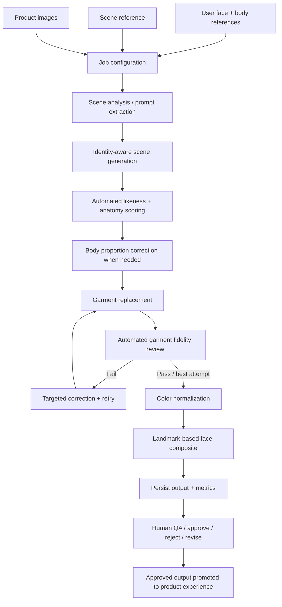

# Sift — AI Creative Systems Case Study

**Creative technology · Generative AI · Image pipelines · Workflow automation · Human-in-the-loop QA**

> A portfolio case study of the generative-image system behind Sift. This repository contains architecture notes and sanitized, representative code excerpts rather than the production codebase.

<!-- Add a strong hero image here: assets/hero.jpg -->

## Overview

Sift was a generative-image product built around a deceptively difficult creative problem: **how do you place a specific person into a reference scene wearing a specific real-world garment while preserving identity, body proportions, product fidelity, pose, lighting, and photographic realism?**

A single model call was not reliable enough. I built a multi-stage production workflow that combined generative models, structured model evaluation, classical computer vision, job orchestration, cloud storage, retry/resume logic, and human quality review.

The system treated AI models as **probabilistic creative components inside a controlled pipeline**, rather than as one-shot generators.

## My role

I worked across product and technical implementation, including:

- AI workflow architecture and prototyping
- Prompt and model evaluation
- Python backend development
- API and database integration
- Image-processing and computer-vision steps
- Automated quality gates and retry logic
- Failure analysis and workflow iteration
- Human review tooling for generated outputs

## The creative systems problem

For every generation, the system needed to reconcile several independent sources of truth:

1. **Person** — face and body reference images
2. **Scene** — a visual reference establishing pose, composition, lighting, and environment
3. **Product** — one or more images of the exact garment
4. **Output constraints** — preserve identity and scene while changing only the intended visual region

The hardest part was not generating an image. It was controlling what **should not change**.

## Pipeline



A more detailed architecture walkthrough is in [`docs/architecture.md`](docs/architecture.md).

## 1. Multi-model orchestration

Different stages had different strengths and failure modes, so the pipeline did not rely on a single provider.

At a high level:

- a scene/reference generation stage established identity and composition;
- multimodal models analyzed references and performed controlled image edits;
- text/multimodal evaluation calls scored likeness, anatomy, and product fidelity;
- classical CV restored facial identity when image editing introduced drift;
- a backend runner coordinated job state, retries, intermediate assets, and persistence.

This separation made it possible to replace or retry one stage without rerunning the entire workflow.

See: [`examples/pipeline_orchestration.py`](examples/pipeline_orchestration.py)

## 2. Automated evaluation instead of subjective "looks good"

Generative workflows fail in specific, recurring ways. I converted those failure modes into explicit checks.

### Identity and anatomy

Candidate images were evaluated against reference photos for facial likeness and visual realism. The pipeline combined those signals when selecting an image to continue downstream.

### Garment fidelity

The generated garment was compared directly with product-reference images across attributes such as:

- color
- pattern
- fabric appearance
- neckline
- straps / sleeves
- fit
- hem
- distinctive details

A failed check became a targeted correction instruction for the next generation attempt rather than simply restarting blindly.

See: [`examples/evaluation_gate.py`](examples/evaluation_gate.py)

## 3. Preserving identity with computer vision

Image-editing models could improve the garment while subtly changing the face. To decouple those objectives, the final pipeline included a classical computer-vision pass using facial landmarks and piecewise affine warping.

The goal was simple: let the generative model solve the clothing edit, then restore the stronger identity representation from an earlier stage without regenerating the entire image.

This stage included graceful fallback behavior when face detection or the landmark model was unavailable.

## 4. Reliability and recovery

Production AI systems have operational failures as well as creative ones. The pipeline accounted for:

- transient API/network errors
- provider/model fallbacks
- repeated generation attempts
- resumable stages using saved intermediate outputs
- per-job temporary working directories
- persistent cloud storage for final and intermediate assets
- database-backed job state

That meant an expensive successful stage could often be reused if a later stage failed.

See: [`examples/model_fallback.py`](examples/model_fallback.py)

## 5. Human-in-the-loop quality control

Automated scores were useful, but they were not the final authority. I also built admin review tooling where outputs could be marked:

- `approved`
- `rejected`
- `needs_revision`
- `pending`

When review state changed, the system re-evaluated which approved image should become the primary output, using generation quality metadata as part of selection.

See: [`examples/human_review.py`](examples/human_review.py)

<!-- Add admin QC screenshot here: assets/qc-review.jpg -->

## Selected technical decisions

| Problem | Approach |
| --- | --- |
| Model output varies between runs | Generate/evaluate multiple candidates and retain the strongest result |
| Identity drifts during garment editing | Separate identity generation from garment editing; restore face using landmark-based compositing |
| Product details disappear | Compare output directly with product reference images and retry with targeted feedback |
| Reference-photo background leaks into edit | Isolate the subject / neutralize reference background before proportion edits |
| Provider failures | Retry transient errors and use model/provider fallbacks |
| Later stage fails after expensive generation | Persist intermediate assets and support stage-specific resume paths |
| Automated scores miss aesthetic problems | Add human QA before promotion into the product experience |

## What I learned

The central lesson was that **creative AI becomes much more useful when generation is treated as a system-design problem**.

The work shifted from asking “which model makes the best image?” to questions like:

- Which model should own each transformation?
- Which regions of an image must be locked?
- How do we convert visual failure modes into machine-readable checks?
- When should the system retry automatically versus escalate to a human?
- Which intermediates are worth saving so a job can resume cheaply?
- How do we preserve the creative qualities of an image while making surgical corrections?

That systems layer — orchestration, constraints, evaluation, recovery, and QA — became as important as the underlying generative models.

## What I would improve next

If I were rebuilding the system today, I would:

1. move more pipeline state out of module-level configuration and into explicit typed job objects;
2. build a versioned evaluation dataset to measure model changes against known failure cases;
3. add structured tracing for cost, latency, model version, prompts, and evaluation results per stage;
4. turn retry policy into a configurable rules layer rather than embedding it in individual stages;
5. expose more of the automated QA evidence directly in the reviewer interface.

## Repository contents

```text
sift-ai-case-study/
├── README.md
├── docs/
│   └── architecture.md
├── examples/
│   ├── pipeline_orchestration.py
│   ├── evaluation_gate.py
│   ├── model_fallback.py
│   └── human_review.py
├── assets/
│   └── README.md
├── .gitignore
└── SECURITY.md
```

## About the code

The excerpts in this repository are intentionally simplified and sanitized. They demonstrate design patterns from the production system without exposing credentials, infrastructure identifiers, private user data, proprietary prompts, or the full Sift codebase.
