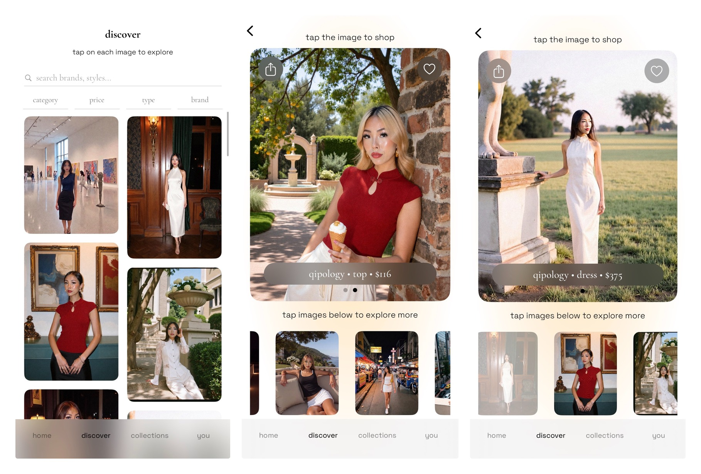

# Sift

**Personalized fashion discovery powered by generative AI**

**Role:** Co-founder / Product & Engineering  
**Platform:** iOS  
**Technologies:** Python, Flask, MySQL, AWS S3, REST APIs, generative image models, multimodal models, computer vision


## Overview

Sift was an iOS fashion discovery app that generated personalized fashion imagery for users.

Instead of viewing clothing only on models or product pages, users could see fashion items represented on a version of themselves, explore the associated products, and save looks they liked.

I built Sift's end-to-end AI generation workflow, database architecture, and backend systems, including model orchestration, image processing, generation-job management, storage, and internal review tooling.

## Product

Generated images appeared directly inside the Sift iOS experience.



## What I built

My work included:

- the end-to-end image-generation workflow
- integrations with generative and multimodal AI services
- Python services for image processing and generation
- the MySQL database layer supporting the generation system
- API endpoints connecting the AI workflow to the iOS product
- asynchronous generation-job management
- cloud image storage and retrieval
- generation status tracking, retries, and error handling
- internal tools for reviewing and approving generated images
- testing and iteration around likeness, product accuracy, and visual consistency

## Workflow

At a high level, the system accepted user photographs, a scene reference, and product imagery, then returned a personalized image to the application.

```text
User references + scene reference + product images
                        ↓
                 Generation workflow
                        ↓
               Evaluation / refinement
                        ↓
                  Quality review
                        ↓
                       Sift
```

The production implementation uses multiple stages and services. Model-routing logic, prompts, evaluation methods, and image-processing details are not included in this public repository.

## Selected code

Sift's production codebase is private. These examples are simplified and redacted versions of engineering patterns I implemented in the production system:

- [Generation runner](examples/generation_runner.py)
- [Database-backed job queue](examples/job_queue.py)
- [Quality-review workflow](examples/quality_review.py)

Names, schemas, infrastructure details, prompts, model selection, and proprietary image-generation logic have been removed.

## Image quality

The generation system had to preserve several things at once:

- user likeness
- body proportions
- reference composition
- recognizable characteristics of the clothing
- realistic lighting and image texture

I tested and iterated on model combinations, prompts, image-processing methods, and evaluation steps to improve these results.

## Internal tools

I also built an internal admin system for operating the product. It supported generation monitoring, image review, approval and rejection, product management, and generation-job controls.

## Repository note

This repository is a portfolio showcase of my work on Sift, not the production source code.

Production code, prompts, detailed model-routing logic, evaluation criteria, infrastructure configuration, private data, and proprietary implementation details are intentionally excluded.
